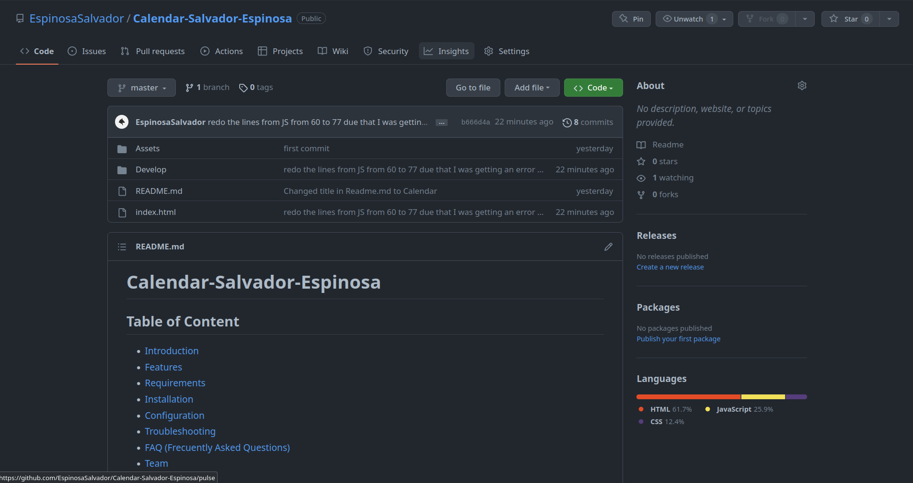
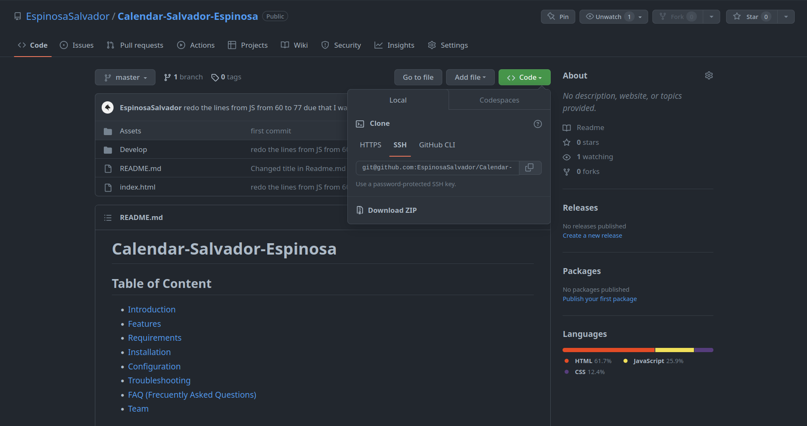

# Calendar-Salvador-Espinosa

## Table of Content

* [Introduction](#introduction)
* [Features](#features)
* [Requirements](#requirements)
* [Installation](#installation)
* [Configuration](#configuration)
* [Troubleshooting](#troubleshooting)
* [FAQ (Frecuently Asked Questions)](#faq-frecuentrly-asked-questions)
* [Team](#team)

## Introduction

This is my Calendar v-1, this was requested by the Tec-Bootcamp and will be future updated and will be evolving throught time.

## Features

This are the following feautures of the Calendar the calendar is up to date due that it is using [Day.js](https://day.js.org/).

there is a button that Clears the local Storage it is above the calendar.

* NOTE THAT CLEARING THE LOCAL STOREAGE HAPPENS WHEN WE EXIT THE WEBPAGE. AND WE OPEN IT AGAIN.

also the Calendar changes color depending on the hour if its in the past, present or future.

* Past = Grey
* Present = Red
* Future = Green

What ever you save will be stored in LocalStorage and will be there even after you close the Webpage.

## Requirements

the requirements to run this webpage are really low due that we are only using *HTML*, *CSS* and *JavaScript*.

* Vs code
* GitHub
* Internet
* JavaScript up to date

## Installation

To install this project please proceed to my [GitHub Repository](https://github.com/EspinosaSalvador/Calendar-Salvador-Espinosa)

you should be able to see this,



Click on code as shown in the image



Copy the SSH key or the HTTPS key and open.

* Terminal
* Git bash
* CMD

either one of this will work. please proceed to the terminal an put in your Terminal,

```
git clone git@github.com:EspinosaSalvador/Calendar-Salvador-Espinosa.git
```

and now you have a copy of the code.

## Configuration

If you want to do any configurations on this project please open a new branch you can do this by putting the following code in your terminal,

```
git checkout -b ＜new-branch＞
```

switch branches putting the following code on your terminal.

```
git checkout ＜branchname＞
```

If you want to show us your code and merge please open a pull request on [Github](https://github.com/EspinosaSalvador/Calendar-Salvador-Espinosa/pulls).

## Troubleshooting

The webpage is a version 1.0 ,please let me know if there are anybug in the webpage by issuing it in [Github](https://github.com/EspinosaSalvador/Calendar-Salvador-Espinosa/issues)

## FAQ (Frecuentrly Asked Questions)

We will update this part when we have some frequently asked question.

## Team

* Salvador Espinosa Valdez

at this moment 11/01/2023 I am the only one working on this project
